.. default-role:: math

.. _introduction:

Introduction
============

The core modules of CHIMERA are ``Likelihood.py`` and ``Bias.py``. The computation of the likelihood uses functions to analyze the gravitational wave (``GW.py``) and electromagnetic gravitational wave (``EM.py``) information. These modules contain specific methods to perform all the preliminary computations that do not change during the likelihood evaluation (a more extended discussion can be found in the next paragraph). Data are loaded with specific classes present in ``DataGW.py`` (e.g., ``DataGWMock`` and ``DataGWLVK``), ``DataEM.py`` (e.g., ``MockGalaxiesMICEv2`` and ``GLADEPlus``), and ``DataInj.py``. 

The algorithm to compute the ``Likelihood`` proceeds as follows:

1. First of all, a tailored ``Likelihood`` class (e.g., ``MockLike``, ``LVKLike``) stores all the population models (``model_*``), GW data (``data_GW*``), galaxy data (``data_GAL*``), pixelization parameters (``nside_list``, ``npix_event``, ``sky_conf``), and integration parameters (``z_int_H0_prior``, ``z_int_sigma``, ``z_int_res``).

2. The ``GW`` class is initialized and pixelization and redshift grids are pre-computed. To ensure efficiency for large galaxy catalog analysis, the code restricts both the sky localization and redshift integration grid. The first task is performed starting from the posterior distribution in RA and Dec using the HEALPix pixelization scheme. The user can specify the desired number of pixels per event (``npix_event``) within a confidence level ellipse (``sky_conf``), choosing from a list of possible pixelizations (``nside_list``). CHIMERA optimizes pixelization for each event to obtain the closest number of pixels to ``npix_event``. The second task must take into account that the integration grid must cover the entire redshift range explored during inference. This is achieved using GW posteriors on luminosity distance, defining the range within ``z_int_sigma`` standard deviations at a resolution of ``z_int_res`` and spanning the entire range of `H_0` explored.

3. The ``EM`` class is initialized and the galaxy redshift distribution is pre-computed pixel-by-pixel. At this point, based on the included catalog (e.g., GLADE+, MICEv2), it is possible to activate catalog-related tasks (e.g., luminosity cut, or associate user-defined redshift uncertainties). Similarly, if defined, the completeness is pre-computed pixel-by-pixel and stored as a class attribute to be accessible during the inference. 

The algorithm to compute the ``Bias`` proceeds as follows:

4. The ``Bias`` class stores all the population models (``model_*``), the directory of the GW injection data (``file_inj``), and the SNR threshold to be applied. Optional arguments also include the catalog redshift interpolant, which can be directly taken from the likelihood. If not given, the bias is evaluated for a uniform in comoving volume galaxy distribution. 

5. The injection catalog is loaded by applying the chosen SNR cut. It is important to ensure that this cut is equivalent to the one adopted when creating the catalog of GW events to analyze.

Finally, the full likelihood is conveniently obtained by first calculating the log-likelihood for all the events and then subtracting the log-bias term, which is computed only once and multiplied by the number of events. The computation of the likelihood and selection bias is performed by calling the ``.compute()`` methods or, in logarithmic form, the ``.compute_ln()`` methods. In the latter case, the models should also be given in logarithmic form.
